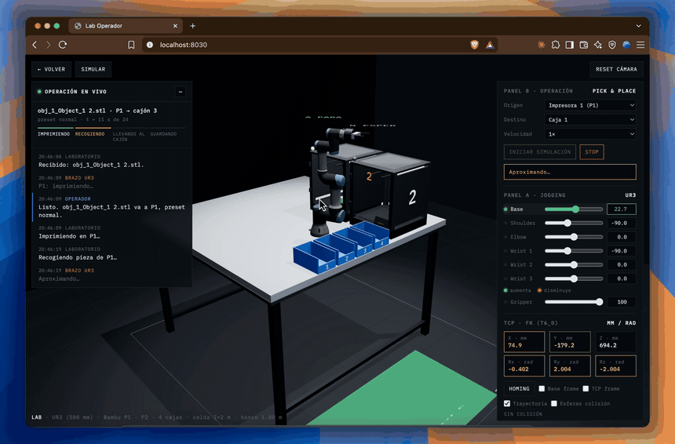
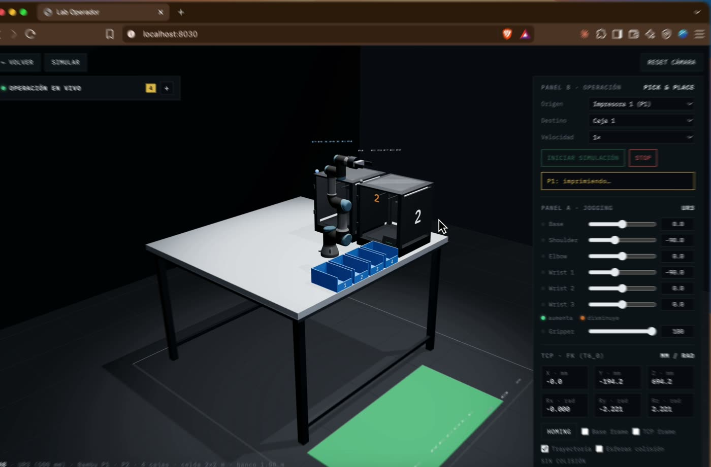

<div align="center">

# 🦾 Lab Operador

**Un laboratorio de impresión 3D que se opera solo.**

Sube tu `.stl`, describe para qué es la pieza y un agente de IA se encarga del resto: elige la
impresora libre, lanza el trabajo, reserva un cajón y coordina un brazo robótico UR3 que retira
la pieza y la guarda. Todo en una simulación 3D en tiempo real.

[](https://www.typescriptlang.org/)
[](https://react.dev/)
[](https://vitejs.dev/)
[](https://threejs.org/)
[](https://r3f.docs.pmnd.rs/)
[](https://fastapi.tiangolo.com/)
[](https://www.python.org/)
[](https://docs.astral.sh/uv/)
[](https://www.anthropic.com/claude)
[](https://strandsagents.com/)
[](https://developers.cloudflare.com/cloudflare-one/connections/connect-networks/)

<a href="docs/media/lab-operador-3d.mp4"></a>

*Construido en un día durante el Claude Build Day de la Universidad Iberoamericana.*

</div>

---

## 💡 El problema

Mandas a imprimir una pieza de ocho horas a las 11 de la noche. A las 3 de la mañana la
impresora termina… y se queda parada. Nadie retira la pieza ni lanza la siguiente hasta que
alguien abre el laboratorio. Son **horas muertas** en equipos de miles de pesos, y no faltan
por tecnología: faltan porque siempre se necesita una persona para sacar una pieza y poner otra.

**Lab Operador** elimina ese paso. Tú diseñas; el laboratorio se encarga de fabricar.

## 🎬 Demo

<div align="center">
<a href="docs/media/lab-operador-demo.mp4"></a>
<br/>
<sub><b>▶ Ver el demo completo</b>: carga del archivo, orden al agente, impresión y guardado en el cajón.</sub>
</div>

## ✨ Qué hace

1. **Recibe la orden en lenguaje natural.** Adjuntas el `.stl` (se previsualiza en un visor 3D) y
   escribes algo como *"4 motores, 250 mm"*.
2. **El agente la interpreta y la ejecuta.** Consulta el estado del laboratorio con
   `get_lab_status`, elige la impresora libre y el perfil adecuado (`fino`, `normal` o
   `estructural`) y lanza el trabajo con `send_to_printer`.
3. **El laboratorio valida antes de confirmar.** El servidor acepta la orden, reserva el primer
   cajón libre y marca la impresora como ocupada. El agente solo dice que el trabajo está en
   marcha cuando quedó **realmente aceptado**: nunca se adelanta a la realidad.
4. **Todo se ve en tiempo real.** Por WebSocket, la simulación 3D muestra la impresión y al brazo
   UR3 recogiendo la pieza y guardándola en su cajón, sincronizada con el estado del servidor.
5. **Maneja varias órdenes.** Si llega una segunda orden con la primera impresora ocupada, se
   asigna a la otra y entra en cola.
6. **Tiene un plan B.** Si el modelo de lenguaje no responde, el botón **Demo** ejecuta el mismo
   flujo de forma determinista, sin depender del agente.

## 🖥️ Stack técnico

| Capa | Tecnología |
|---|---|
| Frontend | [Vite 5](https://vitejs.dev/) + [TypeScript 5](https://www.typescriptlang.org/) |
| Panel de operación | [React 19](https://react.dev/) + [React Three Fiber](https://r3f.docs.pmnd.rs/) + [drei](https://drei.docs.pmnd.rs/) (visor del `.stl`) |
| Simulación 3D | [Three.js](https://threejs.org/) + [urdf-loader](https://github.com/gkjohnson/urdf-loader) (modelo oficial del UR3) + [cannon-es](https://pmndrs.github.io/cannon-es/) |
| Backend | [FastAPI](https://fastapi.tiangolo.com/) sobre Python 3.12, gestionado con [uv](https://docs.astral.sh/uv/) |
| Tiempo real | WebSockets nativos de FastAPI |
| Agente | [Strands Agents](https://strandsagents.com/) + [Claude](https://www.anthropic.com/claude) (por defecto `claude-haiku-4-5`) |
| Autenticación | Contraseña compartida con cookie firmada (`itsdangerous`) |
| Despliegue | Pensado para exponerse detrás de un [Cloudflare Tunnel](https://developers.cloudflare.com/cloudflare-one/connections/connect-networks/) |

## 🏗️ Arquitectura

El **servidor es la única fuente de verdad**: guarda el estado del laboratorio en memoria,
marca los tiempos de cada fase (0, 10, 14, 20 y 24 s) y los emite por WebSocket. El navegador
solo anima lo que el servidor le dice, así que el agente siempre decide sobre información real.

```
Usuario ──▶ Panel (React) ──POST /api/chat──▶ Agente (Strands + Claude)
                                                │  get_lab_status
                                                │  send_to_printer
                                                ▼
                                      Bus del laboratorio (FastAPI)
                                      estado · cola · línea de tiempo
                                                │
                                         WebSocket /ws
                                                ▼
                          Simulación 3D (Three.js) · brazo UR3 · cajones
```

```
claude_build_day/
├── backend/
│   ├── app/
│   │   ├── main.py            # app FastAPI y rutas de salud
│   │   ├── contracts.py       # contratos compartidos con el frontend
│   │   ├── auth.py            # contraseña compartida
│   │   ├── bus/               # estado del lab, cola, línea de tiempo y WebSocket
│   │   └── agent/             # agente operador y sus herramientas
│   └── tests/                 # pruebas del bus, del agente y de la plataforma
└── frontend/
    └── src/
        ├── contracts.ts       # gemelo en TypeScript de contracts.py
        ├── dashboard/         # panel de operación (chat, visor, estado, logs)
        ├── lab/               # escena 3D del laboratorio y brazo UR3
        ├── motion/            # coreografía del brazo
        ├── status/            # barra de estado y botones Demo / Reiniciar
        └── net/               # API, WebSocket y modo simulado
```

## 🚀 Cómo levantarlo

### Requisitos

- [uv](https://docs.astral.sh/uv/) y Python 3.12
- Node.js 20 o superior
- Una API key de [Anthropic](https://console.anthropic.com/) (opcional: sin ella funciona el modo Demo)

### Local

```bash
git clone https://github.com/Adr1anBaz/claude_buildDay.git
cd claude_buildDay
cp .env.example .env
# Edita .env y coloca tu ANTHROPIC_API_KEY

# Backend (un solo worker: el estado vive en memoria)
cd backend && uv sync && uv run --env-file ../.env uvicorn app.main:app --port 8000

# Frontend, en otra terminal (Vite reenvía /api y /ws al backend)
cd frontend && npm install && npm run dev
```

- Aplicación: **http://localhost:5173**
- Sin backend: **http://localhost:5173/?mock=1** simula el flujo completo en el navegador.

### Pruebas

```bash
cd frontend && npm run typecheck
cd backend  && uv run pytest -q
```

## 🔐 Variables de entorno

| Variable | Descripción | Default |
|---|---|---|
| `ANTHROPIC_API_KEY` | API key de Anthropic para el agente | — |
| `ANTHROPIC_MODEL` | Modelo de Claude que usa el agente | `claude-haiku-4-5` |
| `AGENT_TIMEOUT_S` | Tiempo máximo de respuesta del agente | `60` |
| `LAB_PASSWORD` | Contraseña compartida (vacío = sin autenticación) | *(vacío)* |
| `SECRET_KEY` | Firma de la cookie de sesión | `dev-inseguro-…` |
| `TIMELINE_SCALE` | Escala de la línea de tiempo (`1.0` = 24 s reales) | `1.0` |
| `APP_PORT` / `APP_BIND` | Puerto e interfaz publicados para el túnel | `8787` / `127.0.0.1` |

## 🤝 Cómo lo construimos

Lab Operador se construyó en **una sola jornada**, en equipo. Cada integrante trabajó con su
propio agente de Claude en un módulo independiente, en su propia rama y su propia carpeta.
Para que todo encajara:

- **Contratos congelados** (`contracts.ts` / `contracts.py`) definidos al inicio, para que cada
  módulo compilara e integrara desde el primer minuto.
- **Un plan vivo** en [`plan.md`](plan.md) con el estado de cada frente de trabajo, las decisiones
  y la bitácora de integración.
- **Deuda técnica trazable** en [`Deuda_Tecnica.md`](Deuda_Tecnica.md): cada atajo tomado a
  propósito quedó registrado con un ID y referenciado en el código.
- **Skills de Claude Code** (`/ws-start`, `/plan-update`, `/deuda`, `/ws-merge`) que automatizaron
  el flujo de git y validaron que nadie tocara archivos ajenos.

## 👥 Equipo

| Integrante | Área |
|---|---|
| José Luis | Plataforma, contratos, integración y despliegue |
| Daniela | Panel de operación |
| Elías | Laboratorio 3D y modelo del brazo UR3 |
| Sebas | Coreografía de movimiento |
| Fernando | Estado del laboratorio y plan B |
| Adrián | Agente operador |
